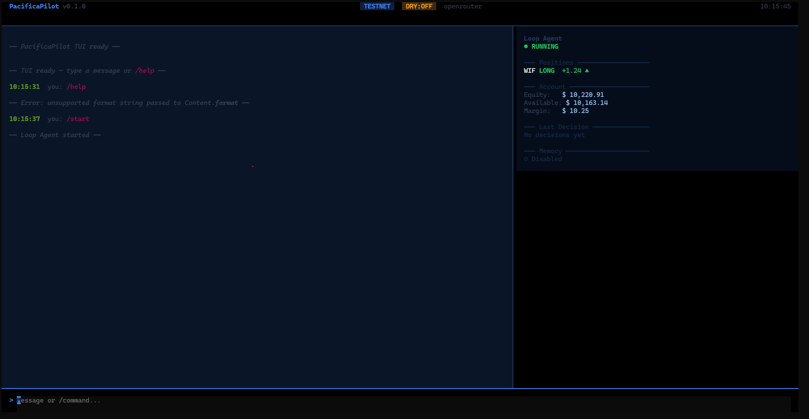
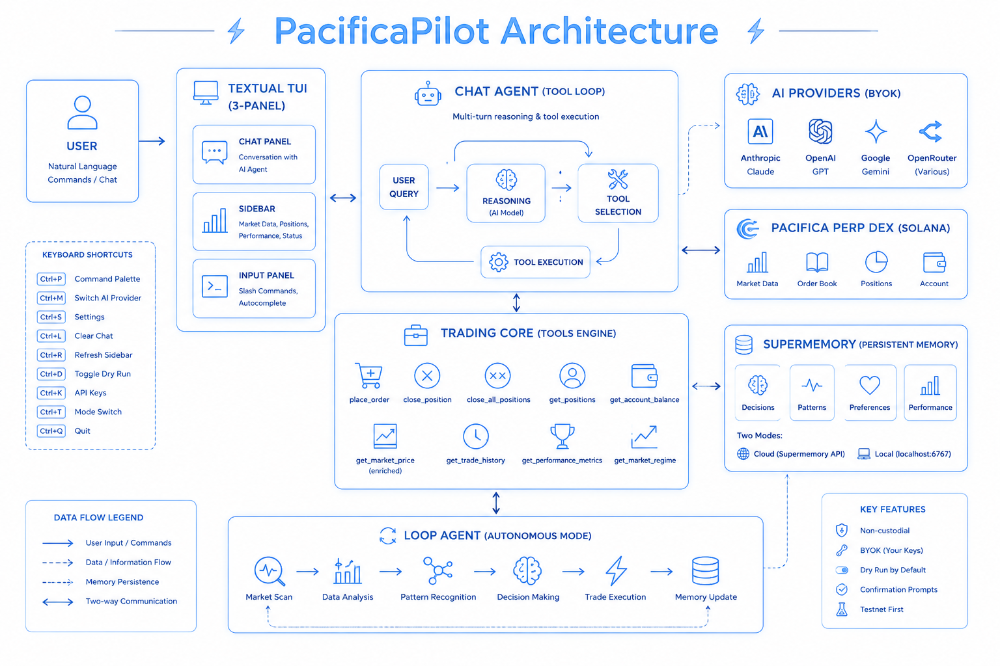

# PacificaPilot

**AI trading agent for Pacifica Perpetual Futures with persistent memory, multi-provider AI, and natural language trading.**

[](LICENSE)
[](https://python.org)
[](https://youtu.be/XSp-tUbp6i8)

```
pip install pacificapilot
pacifica init
pacifica start
```



## Quick Start

```bash
pip install pacificapilot

# Setup wizard
pacifica init
# -> Pacifica keys -> AI provider -> Trading config -> Supermemory -> Telegram

# Launch TUI
pacifica start
```

Type `/help` for commands, or just chat naturally.  
`/start` boots the Loop Agent, `/stop` stops it.  
`/config` to view/edit settings, `/apikey supermemory <key> [local|cloud]`.

### Keyboard Shortcuts

```
Ctrl+P  Command palette     Ctrl+M  Switch AI provider
Ctrl+S  Settings toggles    Ctrl+L  Clear chat
Ctrl+R  Refresh sidebar     Ctrl+D  Toggle dry run
Ctrl+K  API key management  Ctrl+T  Mode switch
Ctrl+Q  Quit
```

## Architecture



```
Chat Agent (tool loop) <-> Trading Core <-> Pacifica API
     |                        |
Loop Agent (autonomous)    Supermemory
     |
Textual TUI (3-panel)
```

## Features

- **Persistent memory** -- Trades, patterns, and preferences stored in Supermemory across sessions
- **Agentic chat** -- Multi-turn tool loop: gathers data, reasons, then responds
- **Autonomous loop agent** -- 24/7 AI-driven market monitoring and trading
- **Live technical analysis** -- RSI, MACD, Bollinger Bands, funding, volume, market regime
- **9 trading tools** -- place/close orders, market analysis, performance metrics, regime detection
- **Multi-provider AI** -- Anthropic, OpenAI, Google Gemini, OpenRouter (BYOK)
- **Textual TUI** -- 3-panel layout with slash autocomplete, live sidebar, keyboard shortcuts
- **Non-custodial** -- Your keys, your machine. Nothing leaves.

### Supported Providers

| Provider | Models |
|----------|--------|
| Anthropic | Claude Sonnet 4, Haiku 3.5 |
| OpenAI | GPT-4o, GPT-4o-mini |
| Google | Gemini 2.0 Flash, Pro |
| OpenRouter | Any model (e.g. meta-llama, deepseek, mistral) |

## Supermemory

Every AI decision, market pattern, user preference, and daily summary is stored in Supermemory -- a persistent, searchable memory layer that survives restarts.

```
decisions    -> "LONG BTC, confidence 75%, RSI 35"
patterns     -> "Funding spike on ETH: 0.003"
preferences  -> "Never trade BONK" -- said once, remembered forever
performance  -> "Daily: 3 trades, +$12.50, 67% win rate"
```

**Two modes:**

- **Cloud** -- `https://app.supermemory.ai` (default, cross-platform)
- **Local** -- `npx supermemory local` (offline, zero data leaves your machine)

> **Windows users:** Local mode only works on Linux and macOS.  
> Install [WSL](https://learn.microsoft.com/en-us/windows/wsl/install), then inside WSL run `npx supermemory local`.  
> Copy the API key from the terminal output and paste it back in the setup wizard.

## Tools

`place_order` · `close_position` · `close_all_positions` · `get_positions` · `get_account_balance` · `get_market_price` · `get_trade_history` · `get_performance_metrics` · `get_market_regime`

## Security

- **Non-custodial** -- Keys stored in `~/.pacificapilot/secrets.env` (chmod 600)
- **BYOK** -- Your AI keys go directly to your provider
- **Confirmation prompts** -- Every trade requires explicit yes/no
- **Testnet first** -- Dry run by default, mainnet requires confirmation

## Links

- [GitHub](https://github.com/MayurK-cmd/Pacifica-Pilot)
- [Issues](https://github.com/MayurK-cmd/Pacifica-Pilot/issues)
- [License](LICENSE) -- MIT
- [Contributing](CONTRIBUTING.md)

**Disclaimer:** PacificaPilot is experimental software for educational purposes. Trading perpetual futures carries significant risk. AI decisions are not financial advice. Start with testnet and dry run enabled.
